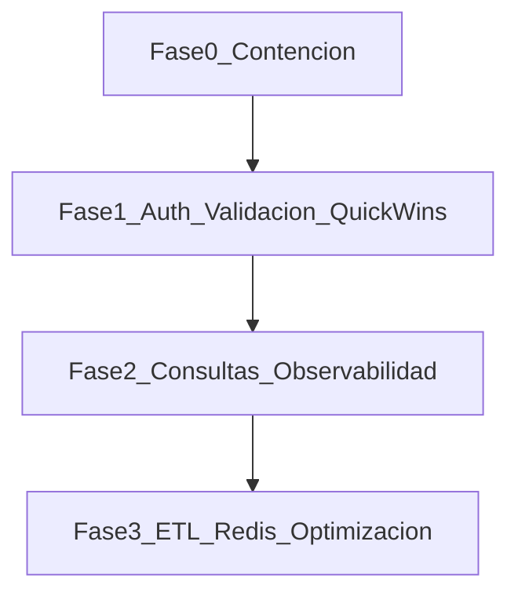

# Issues backlog — seguridad y optimización

**Proyecto:** ACUFADE Routes (`Routes/`)  
**Rama de trabajo:** `routes/fix`  
**Fecha de auditoría:** 2026-09-07  
**Alcance:** backend Express/Auth0, frontend React/Vite, consultas a Velneo y Google Routes.  
**Última actualización de trabajo:** 2026-09-07 (Fase 2: PERF-009)

## Registro de avances

| Fecha | Issue | Cambio | Archivos | Notas |
|-------|-------|--------|----------|-------|
| 2026-09-07 | SEC-002 | Código: ya no se loguea la URL con `api_key` | `backend/services/data.js` | **Pendiente operativo:** rotar `VELNEO_API_KEY` en Velneo y actualizar `.env` |
| 2026-09-07 | SEC-001 | Fail-fast si falta `SESSION_SECRET`; eliminado fallback hardcodeado | `backend/main.js` | Asegurar `SESSION_SECRET` en `.env` local/staging/prod |
| 2026-09-07 | SEC-003 | Redirect solo con allowlist; `req.query.state` ya no se usa como URL | `backend/main.js` | `getSafeReturnTo()`; CORS reutiliza `ALLOWED_ORIGINS` (avance parcial SEC-013) |
| 2026-09-07 | PERF-001 | Single-flight: una sola `fetchAllData` ante N requests con caché fría | `backend/services/data.js` | Logs `cache=hit\|miss\|wait\|set`. No reduce el tamaño de una carga; evita cargas duplicadas concurrentes |
| 2026-09-07 | hotfix | Filtro municipios: comparación tipada `String(ser_nom)` / `String(id)` | `backend/services/data.js` | Evita lista vacía si Velneo envía números; logs de conteo tras filtro |
| 2026-09-07 | hotfix | Causa raíz municipios vacíos: API key sin GET en `mun_m`; `tip_ser` fields con `mun_m` inválido | `backend/services/data.js` | Fallback nombres `Municipio {id}` desde `ate_m`; **acción usuario:** habilitar GET `mun_m` en Velneo |
| 2026-09-07 | ops | Nueva `VELNEO_API_KEY` verificada: `mun_m` total=89, `tip_ser` OK con `mun_m` | `backend/.env` | Reiniciar backend para vaciar caché y recargar env |
| 2026-09-07 | bug | Google Routes 400: `API key not valid` (`GOOGLE_API_KEY`) | `backend/.env`, `backend/services/routes.js` | Logs con mensaje Google; TRANSIT sin routeModifiers. **Acción:** clave válida + Routes API habilitada |
| 2026-09-07 | PERF-003 + hotfix | Trabajadoras vacías por municipio: filtro entities, coerción `off`/`es_tra_sim`, IDs `String()` | `backend/services/data.js` | Logs `Pipeline:` y `trabajadores_filtrados=`; reiniciar backend para vaciar caché |
| 2026-09-07 | PERF-002 | `joinData` indexado con `Map` O(n+m); logs `fetch_ms` / `process_ms` | `backend/services/data.js` | Reduce CPU post-Velneo en cada cache miss |
| 2026-09-07 | PERF-004 | pageSize 500 (env), retry/backoff, throw si crítico vacío, no cachear parcial | `backend/services/data.js` | Override: `VELNEO_PAGE_SIZE`, `VELNEO_MAX_RETRIES`, `VELNEO_TIMEOUT_MS` |
| 2026-09-07 | PERF-005 | `/municipalities` carga ligera `mun_m`+`tip_ser` (no pipeline completo) | `backend/services/data.js` | Logs `municipalities=hit\|miss\|wait\|set`; full load solo al pedir workers/points/routes |
| 2026-09-07 | PERF-007 | Caché municipios en cliente + debounce 400ms en workers | `frontend/src/services/map_service.ts`, `worker_selector.tsx` | Remounts no re-fetchan municipios; 5 municipios seguidos → 1 request workers |
| 2026-09-07 | ops | `GOOGLE_API_KEY` y `VELNEO_API_KEY` verificadas (Routes OK, mun_m total=89) | `backend/.env` | Reiniciar backend para vaciar caché de rutas fallidas |
| 2026-09-07 | PERF-008 + SEC-016 | Retry/backoff Google Routes; LRU+TTL; no cachear fallos; skip mismo punto | `backend/services/routes.js` | Env: `GOOGLE_ROUTES_*`, `ROUTE_CACHE_TTL_MS`, `ROUTE_CACHE_MAX` |
| 2026-09-07 | SEC-006 | 500 sin `details` en prod; `requestId` en logs y JSON | `backend/utils/errors.js`, `routes/map.js`, `main.js` | En `development` sí se envía `details` |
| 2026-09-07 | SEC-008 | Máx. 20 workers / 50 municipios; IDs tipados | `backend/utils/queryParams.js`, `routes/map.js` | Env: `MAX_WORKERS`, `MAX_MUNICIPALITIES`. SEC-017 (Zod) sigue open |
| 2026-09-07 | SEC-009 | `trust proxy` configurable (`TRUST_PROXY`) | `backend/main.js` | Default 1 hop para IP/`X-Forwarded-Proto` |
| 2026-09-07 | SEC-007 | Rate limit IP+usuario; más estricto en `/routes` y `/data` | `backend/middleware/rateLimit.js`, `routes/map.js` | Env: `RATE_LIMIT_*`; cabecera `Retry-After` |
| 2026-09-07 | SEC-005 | Eliminado `GET /maps/data` y cliente `getData()` | `backend/routes/map.js`, `frontend/.../map_service.ts` | UI ya usaba endpoints filtrados |
| 2026-09-07 | SEC-011 | `npm audit fix` + axios/express; eliminados JWT no usados | `backend/package.json`, lockfile | `npm audit --audit-level=high` → 0. Avance SEC-023 |
| 2026-09-07 | SEC-010 | No se guarda `id_token` en express-session; se borra si existía | `backend/main.js` | Auth0 cookie OIDC sigue siendo la fuente de auth |
| 2026-09-07 | SEC-018 | `/auth/check` solo expone `{ name, email, picture }` | `backend/routes/auth.js`, `frontend/.../auth.ts` | Sin claims Auth0 internos |
| 2026-09-07 | SEC-022 | Logger por niveles; sin IDs/coords/PII en logs info; frontend sin dump en prod | `backend/utils/logger.js`, services, map routes, frontend | `LOG_LEVEL` / `DEBUG_ACUFADE_DATA` |
| 2026-09-07 | SEC-019 | Fail-fast env + `.env.example`; `config.js` centraliza secretos Auth0/sesión | `backend/config.js`, `main.js`, `.env.example` | `AUTH0_SECRET` opcional (avance SEC-015) |
| 2026-09-07 | PERF-009 | `/health` + logs `event=` (duration_ms, cache, velneo_pages, google_routes) | `observability.js`, `data.js`, `routes.js`, `main.js` | Sin auth en `/health` |

### Verificación realizada / pendiente

| Issue | Criterio | Resultado |
|-------|----------|-----------|
| SEC-002 | Logs sin `api_key` | Código listo; verificar en runtime tras reinicio: filtrar logs por `api_key` → 0 hits |
| SEC-002 | Rotación de clave | **Pendiente usuario** |
| SEC-001 | Arranque sin secreto falla | Código listo; probar `node main.js` sin `SESSION_SECRET` → exit 1 |
| SEC-003 | `/?state=https://evil.com` no redirige a evil | Código listo; verificar con `curl -I` tras reinicio |
| PERF-001 | 10 requests concurrentes → 1 `fetchAllData` | Código listo; ver logs `cache=miss` (1) + `cache=wait` (resto) al recargar varias pestañas con caché fría |

---

## Leyenda de prioridad

| Prioridad | Significado |
|-----------|-------------|
| **P0** | Contención inmediata: secretos, redirect abierto, exposición de claves |
| **P1** | Alto impacto: autorización, PII, DoS/coste, quick wins de rendimiento |
| **P2** | Hardening y reducción de consultas / payloads |
| **P3** | Escalado estructural (ETL, Redis, optimización avanzada de rutas) |

## Baseline medido (no estimado)

| Área | Evidencia |
|------|-----------|
| Cold start Velneo | `ent_m` ≈ 17 767 registros / 178 páginas; `ent_rel_m` ≈ 17 357 / 174 páginas; ~350–450 HTTP requests por cache miss |
| Dependencias backend | `npm audit`: **16** vulns (`1 critical`, `8 high`, `5 moderate`, `2 low`) |
| Dependencias frontend | `npm audit`: **33** vulns (`1 critical`, `18 high`, `11 moderate`, `3 low`) |
| Duplicación UI | múltiples `GET /maps/municipalities`; al seleccionar trabajadores: `/points` + `/routes` + `/workers` |

---

## Resumen ejecutivo

| ID | Prioridad | Título | Área | Estado |
|----|-----------|--------|------|--------|
| SEC-001 | P0 | Eliminar fallback de `SESSION_SECRET` | Seguridad | done (código) |
| SEC-002 | P0 | Dejar de loguear API key de Velneo y rotarla | Seguridad | in_progress (falta rotar clave) |
| SEC-003 | P0 | Cerrar open redirect en `GET /` | Seguridad | done (código) |
| SEC-004 | P1 | RBAC / scopes Auth0 en `/maps/*` | Seguridad | open |
| SEC-005 | P1 | Restringir o eliminar `GET /maps/data` | Seguridad | done (código) |
| SEC-006 | P1 | Errores genéricos en producción | Seguridad | done (código) |
| SEC-007 | P1 | Rate limiting en endpoints costosos | Seguridad | done (código) |
| SEC-008 | P1 | Límites y validación de `workers` / query params | Seguridad | done (código) |
| SEC-009 | P1 | `trust proxy` y cookies detrás de reverse proxy | Seguridad | done (código) |
| SEC-010 | P1 | No almacenar `id_token` en sesión sin uso | Seguridad | done (código) |
| SEC-011 | P1 | Actualizar dependencias vulnerables (backend) | Seguridad | done (código) |
| SEC-012 | P2 | API key Velneo fuera del query string | Seguridad | open |
| SEC-013 | P2 | CORS dinámico por entorno | Seguridad | open (avance parcial vía ALLOWED_ORIGINS) |
| SEC-014 | P2 | Unificar sistema de sesiones | Seguridad | open |
| SEC-015 | P2 | Secreto OIDC separado del client secret | Seguridad | open |
| SEC-016 | P2 | Caché de rutas con TTL / LRU | Seguridad + Perf | done (código) |
| SEC-017 | P2 | Validación de entrada con schema | Seguridad | open |
| SEC-018 | P2 | DTO mínimo en `/auth/check` | Seguridad | done (código) |
| SEC-019 | P2 | Fail-fast de variables de entorno | Seguridad | done (código) |
| SEC-020 | P2 | Auditar / actualizar dependencias frontend | Seguridad | open |
| SEC-021 | P3 | Logout CSRF (GET) | Seguridad | open |
| SEC-022 | P2 | Eliminar logs verbosos con PII | Seguridad | done (código) |
| SEC-023 | P2 | Eliminar dependencias no usadas | Seguridad | in_progress (backend done) |
| PERF-001 | P1 | Single-flight / anti cache stampede | Rendimiento | done (código) |
| PERF-002 | P1 | Joins e índices O(n+m) con `Map`/`Set` | Rendimiento | done (código) |
| PERF-003 | P1 | Corregir filtro lógico de `entities` | Correctitud | done (código) |
| PERF-004 | P1 | Paginación Velneo: `push`, page size, retry | Rendimiento | done (código) |
| PERF-005 | P2 | Cold start ligero para municipios | Rendimiento | done (código) |
| PERF-006 | P2 | Endpoint agregado / menos round-trips UI | Rendimiento | open |
| PERF-007 | P2 | Caché cliente + debounce selectores | Rendimiento | done (código) |
| PERF-008 | P2 | Google Routes: timeout, backoff, cuota | Rendimiento | done (código) |
| PERF-009 | P2 | Baseline y observabilidad mínima | Rendimiento | done (código) |
| PERF-010 | P3 | ETL diario / almacenamiento persistente | Escalado | open |
| PERF-011 | P3 | Caché compartida (Redis) | Escalado | open |
| PERF-012 | P3 | Filtros nativos en Velneo | Escalado | open |
| PERF-013 | P3 | Optimización de orden de rutas (TSP / Route Optimization) | Escalado | open |

---

# Seguridad

## SEC-001 — Eliminar fallback de `SESSION_SECRET` (P0)

| Campo | Detalle |
|-------|---------|
| **Estado** | done (código) — 2026-09-07 |
| **Evidencia** | Antes: `backend/main.js` con fallback `'tu-secreto-super-seguro'`. Ahora: fail-fast + `SESSION_SECRET` obligatorio. |
| **Impacto** | Sin `SESSION_SECRET` se puede forjar cookies de sesión. |
| **Solución aplicada** | Si falta `SESSION_SECRET`, `process.exit(1)` con mensaje claro. Sin valor por defecto. |
| **Dependencias** | SEC-019 (validación completa de env pendiente) |
| **Criterio de aceptación** | Sin `SESSION_SECRET` el proceso termina con error claro. No existe valor por defecto en código. |
| **Notas** | Local/staging/prod deben definir `SESSION_SECRET` en `.env` o el servidor no arranca. |

## SEC-002 — Dejar de loguear API key de Velneo y rotarla (P0)

| Campo | Detalle |
|-------|---------|
| **Estado** | in_progress — 2026-09-07 (código done; rotación pendiente) |
| **Evidencia** | Antes: `data.js` hacía `console.log(url)` con `api_key=`. Ahora: `Consultando Velneo endpoint=...` sin clave. |
| **Impacto** | Clave en stdout, agregadores de logs y backups. Compromiso de datos Velneo. |
| **Solución aplicada** | Eliminado log de URL completa. Se loguea solo el nombre del endpoint. |
| **Pendiente** | **Rotar `VELNEO_API_KEY`** en el panel Velneo, actualizar `.env` y reiniciar. Revisar logs históricos por fuga. |
| **Dependencias** | Ninguna |
| **Criterio de aceptación** | Ningún log contiene `api_key` ni la query con clave. Clave rotada documentada. |

## SEC-003 — Cerrar open redirect en `GET /` (P0)

| Campo | Detalle |
|-------|---------|
| **Estado** | done (código) — 2026-09-07 |
| **Evidencia** | Antes: `returnTo = session.returnTo \|\| req.query.state \|\| FRONTEND_URL`. Ahora: `getSafeReturnTo(session.returnTo)` con allowlist. |
| **Impacto** | Phishing post-login vía `/?state=https://evil.com`. |
| **Solución aplicada** | Allowlist (`ALLOWED_ORIGINS`). `req.query.state` ya no se usa como destino. Fallback a `FRONTEND_URL` / localhost. Redirect de error también validado. |
| **Dependencias** | SEC-013 (CORS dinámico por env puro sigue pendiente; se reutiliza la misma lista) |
| **Criterio de aceptación** | `GET /?state=https://evil.com` redirige a allowlist, no a evil. |

## SEC-004 — RBAC / scopes Auth0 en `/maps/*` (P1)

| Campo | Detalle |
|-------|---------|
| **Estado** | open |
| **Evidencia** | [`backend/main.js:73`](backend/main.js) solo `requiresAuth()`; `AUTH0_AUDIENCE` documentado en README pero no usado |
| **Impacto** | Cualquier usuario Auth0 del tenant accede a PII (CIF, coordenadas, nombres). |
| **Solución** | Roles/scopes (p.ej. `routes:read`). Middleware 403 sin scope. Restringir login a usuarios corporativos. |
| **Dependencias** | Configuración Auth0 tenant (fuera de repo) |
| **Criterio de aceptación** | Usuario sin rol/scope recibe **403** en `/maps/*`. Test con token sin permiso. |

## SEC-005 — Restringir o eliminar `GET /maps/data` (P1)

| Campo | Detalle |
|-------|---------|
| **Estado** | done (código) — 2026-09-07 |
| **Evidencia** | Endpoint retirado de `backend/routes/map.js`; `getData`/`MapData` retirados del frontend |
| **Impacto** | Dump masivo de PII en una petición. |
| **Solución aplicada** | Eliminación del endpoint (UI solo usa `/municipalities`, `/workers`, `/points`, `/routes`). |
| **Dependencias** | — |
| **Criterio de aceptación** | `GET /maps/data` → **404**. UI sigue funcionando con endpoints filtrados. |

## SEC-006 — Errores genéricos en producción (P1)

| Campo | Detalle |
|-------|---------|
| **Estado** | done (código) — 2026-09-07 |
| **Evidencia** | `sendServerError` / `globalErrorHandler` en `backend/utils/errors.js` |
| **Impacto** | Fuga de detalles internos al cliente. |
| **Solución aplicada** | JSON 500 con `error` + `requestId`; `details` solo si `NODE_ENV !== 'production'`. |
| **Dependencias** | PERF-009 (correlation ID más rico, opcional) |
| **Criterio de aceptación** | Con `NODE_ENV=production`, JSON 500 **sin** campo `details`. |

## SEC-007 — Rate limiting en endpoints costosos (P1)

| Campo | Detalle |
|-------|---------|
| **Estado** | done (código) — 2026-09-07 |
| **Evidencia** | `backend/middleware/rateLimit.js`; aplicado en `routes/map.js` |
| **Impacto** | Agotar cuota Google Routes / saturar Velneo (DoS económico). |
| **Solución aplicada** | `express-rate-limit`: maps 60/min, routes 20/min, data 10/min; clave IP (`ipKeyGenerator`) + `sub`/email; `Retry-After`. |
| **Dependencias** | SEC-008, SEC-009 |
| **Criterio de aceptación** | Tras N peticiones en ventana T → **429** + `Retry-After`. |

## SEC-008 — Límites y validación de `workers` / query params (P1)

| Campo | Detalle |
|-------|---------|
| **Estado** | done (código) — 2026-09-07 |
| **Evidencia** | `parseWorkers` / `parseMunicipalities` en `backend/utils/queryParams.js` |
| **Impacto** | `?workers=` × cientos dispara llamadas Google. |
| **Solución aplicada** | Máx. 20 workers / 50 municipios; regex ID; dedupe. Override: `MAX_WORKERS`, `MAX_MUNICIPALITIES`. |
| **Dependencias** | SEC-017 (schema Zod/Joi, pendiente) |
| **Criterio de aceptación** | >20 workers → **400**. ≤20 IDs válidos → pasan validación. |

## SEC-009 — `trust proxy` y cookies detrás de reverse proxy (P1)

| Campo | Detalle |
|-------|---------|
| **Estado** | done (código) — 2026-09-07 |
| **Evidencia** | `app.set('trust proxy', …)` en `backend/main.js` |
| **Impacto** | Cookies `Secure` / IP de rate limit incorrectas tras Heroku/ALB. |
| **Solución aplicada** | Default 1 hop; override `TRUST_PROXY` (`false`/`0`/`N`/`true`). |
| **Dependencias** | Ninguna |
| **Criterio de aceptación** | `req.ip` refleja cliente tras proxy; cookies Secure en HTTPS vía `X-Forwarded-Proto`. |

## SEC-010 — No almacenar `id_token` en sesión sin uso (P1)

| Campo | Detalle |
|-------|---------|
| **Estado** | done (código) — 2026-09-07 |
| **Evidencia** | `backend/main.js` ya no asigna `req.session.id_token`; limpia restos previos |
| **Impacto** | Superficie extra si la sesión se compromete. |
| **Solución aplicada** | Eliminado almacenamiento; auth vía cookie `express-openid-connect`. |
| **Dependencias** | SEC-014 (unificar sesiones, pendiente) |
| **Criterio de aceptación** | Tras login, sesión express sin `id_token`. |

## SEC-011 — Actualizar dependencias vulnerables (backend) (P1)

| Campo | Detalle |
|-------|---------|
| **Estado** | done (código) — 2026-09-07 |
| **Evidencia** | `npm audit --audit-level=high` → 0 vulnerabilidades |
| **Impacto** | DoS, prototype pollution, SSRF latente en axios/qs/etc. |
| **Solución aplicada** | `npm audit fix`; bumps axios/express/session; eliminados `express-jwt`, `jsonwebtoken`, `jwks-rsa` (no usados; Auth0 vía OIDC). |
| **Dependencias** | Ninguna |
| **Criterio de aceptación** | `npm audit --audit-level=high` en backend sin high/critical. |

## SEC-012 — API key Velneo fuera del query string (P2)

| Campo | Detalle |
|-------|---------|
| **Estado** | open |
| **Evidencia** | [`backend/services/data.js:25`](backend/services/data.js) |
| **Impacto** | Clave en logs de proxies / historial de requests. |
| **Solución** | Header de autenticación si Velneo lo soporta; rotación periódica. |
| **Dependencias** | Capacidades API Velneo; SEC-002 |
| **Criterio de aceptación** | Captura de red en staging: clave no aparece en query string. |

## SEC-013 — CORS dinámico por entorno (P2)

| Campo | Detalle |
|-------|---------|
| **Estado** | open |
| **Evidencia** | [`backend/main.js:21-26`](backend/main.js) — localhost + Vercel hardcodeado + `FRONTEND_URL` |
| **Impacto** | Orígenes de otros entornos; `undefined` en array. |
| **Solución** | Función `origin` con allowlist desde env (lista separada por comas). Sin localhost en prod. |
| **Dependencias** | SEC-003 |
| **Criterio de aceptación** | Origen no listado → sin `Access-Control-Allow-Origin`. |

## SEC-014 — Unificar sistema de sesiones (P2)

| Campo | Detalle |
|-------|---------|
| **Estado** | open |
| **Evidencia** | `express-session` + sesión OIDC en [`backend/main.js`](backend/main.js) |
| **Impacto** | Dos cookies/secretos; misconfiguración. |
| **Solución** | Preferir solo sesión de `express-openid-connect` si no hace falta `express-session`. |
| **Dependencias** | SEC-010 |
| **Criterio de aceptación** | Una cookie de sesión documentada; login/logout verificados. |

## SEC-015 — Secreto OIDC separado del client secret (P2)

| Campo | Detalle |
|-------|---------|
| **Estado** | open |
| **Evidencia** | [`backend/main.js:54`](backend/main.js) — `secret: AUTH0_CLIENT_SECRET` |
| **Impacto** | Acopla compromiso de cookies y client secret OAuth. |
| **Solución** | `APP_SESSION_SECRET` dedicado documentado en `.env.example`. |
| **Dependencias** | SEC-019 |
| **Criterio de aceptación** | Variables separadas; rotación independiente documentada. |

## SEC-016 — Caché de rutas con TTL / LRU (P2)

| Campo | Detalle |
|-------|---------|
| **Estado** | done (código) — 2026-09-07 |
| **Evidencia** | `TtlLruCache` en `routes.js`; defaults TTL 1 h, max 1000 tramos / 200 trabajadores. |
| **Impacto** | OOM / DoS por crecimiento ilimitado; caché de fallos bloqueaba reintentos. |
| **Solución aplicada** | LRU+TTL; no cachear polylines/nulos ni trabajadores sin ruta válida. |
| **Dependencias** | PERF-008 |
| **Criterio de aceptación** | Entradas caducan/evictan; tras arreglar API key no hace falta limpiar fallos cacheados. |

## SEC-017 — Validación de entrada con schema (P2)

| Campo | Detalle |
|-------|---------|
| **Estado** | open |
| **Evidencia** | [`backend/routes/map.js:35-42,88-98,122-126`](backend/routes/map.js) |
| **Impacto** | Payloads oversized; IDs inválidos que disparan trabajo costoso. |
| **Solución** | Zod/Joi: tipo, longitud, max items, regex. |
| **Dependencias** | SEC-008 |
| **Criterio de aceptación** | Input inválido → **400**. Tests unitarios de schema. |

## SEC-018 — DTO mínimo en `/auth/check` (P2)

| Campo | Detalle |
|-------|---------|
| **Estado** | done (código) — 2026-09-07 |
| **Evidencia** | `toPublicUser()` en `backend/routes/auth.js` |
| **Impacto** | Claims internos Auth0 expuestos al frontend. |
| **Solución aplicada** | Respuesta `{ name, email, picture }` alineada con `user_info.tsx`. |
| **Dependencias** | Ninguna |
| **Criterio de aceptación** | JSON sin claims no usados por el frontend. |

## SEC-019 — Fail-fast de variables de entorno (P2)

| Campo | Detalle |
|-------|---------|
| **Estado** | done (código) — 2026-09-07 |
| **Evidencia** | `backend/config.js` valida 9 vars; `.env.example` trackeado |
| **Impacto** | Arranque incompleto → secretos por defecto / fallos silenciosos. |
| **Solución aplicada** | Exit 1 con lista de faltantes; `main.js` usa `config`; `AUTH0_SECRET` opcional. |
| **Dependencias** | SEC-001 (cubierto); SEC-015 parcial |
| **Criterio de aceptación** | Falta var obligatoria → exit code ≠ 0 con mensaje explícito. |

## SEC-020 — Auditar / actualizar dependencias frontend (P2)

| Campo | Detalle |
|-------|---------|
| **Estado** | open |
| **Evidencia** | `npm audit` frontend: 33 vulns (`1 critical`, `18 high`) |
| **Impacto** | Principalmente toolchain/build; mantener limpio. |
| **Solución** | `npm audit fix`, actualizar Vite; CI con audit producción. |
| **Dependencias** | Ninguna |
| **Criterio de aceptación** | `npm audit --production --audit-level=high` sin high/critical. |

## SEC-021 — Logout CSRF vía GET (P3)

| Campo | Detalle |
|-------|---------|
| **Estado** | open |
| **Evidencia** | [`frontend/src/services/auth.ts`](frontend/src/services/auth.ts) — navegación a `/logout?returnTo=` |
| **Impacto** | Sitio externo puede forzar logout (molestia). |
| **Solución** | POST + CSRF o SameSite estricto + confirmación. |
| **Dependencias** | SEC-014 |
| **Criterio de aceptación** | Logout no ejecutable con simple GET cross-site. |

## SEC-022 — Eliminar logs verbosos con PII (P2)

| Campo | Detalle |
|-------|---------|
| **Estado** | done (código) — 2026-09-07 |
| **Evidencia** | `backend/utils/logger.js`; rutas/servicios sin IDs/coords en nivel info; frontend gated con `import.meta.env.DEV` |
| **Impacto** | PII en DevTools y logs de servidor. |
| **Solución aplicada** | Logger `error/warn/info/debug`; métricas con counts; sin dumps de workers/puntos/rutas en build prod. |
| **Dependencias** | PERF-009 (métricas más ricas, opcional) |
| **Criterio de aceptación** | Build prod sin logs de puntos/rutas/IDs operativos. |

## SEC-023 — Eliminar dependencias no usadas (P2)

| Campo | Detalle |
|-------|---------|
| **Estado** | in_progress — backend JWT limpio (2026-09-07); falta frontend `@auth0/auth0-react` |
| **Evidencia** | Backend: eliminados con SEC-011. Frontend: `@auth0/auth0-react` sin import (pendiente). |
| **Impacto** | Superficie supply-chain y confusión arquitectónica. |
| **Solución** | Eliminar paquetes huérfanos. |
| **Dependencias** | Ninguna |
| **Criterio de aceptación** | Dependencias directas alineadas con imports reales. |

---

# Rendimiento y consultas

## PERF-001 — Single-flight / anti cache stampede (P1)

| Campo | Detalle |
|-------|---------|
| **Estado** | done (código) — 2026-09-07 |
| **Evidencia** | Antes: check-then-act sin lock. Ahora: `processedDataInFlight` + `loadAndCacheProcessedData()`. |
| **Impacto** | N requests concurrentes a `/municipalities` → N× `fetchAllData()` (~350+ páginas cada uno). |
| **Solución aplicada** | Promesa in-flight compartida. Logs `cache=hit`, `cache=miss`, `cache=wait`, `cache=set`. |
| **Dependencias** | Ninguna |
| **Criterio de aceptación** | 10 requests concurrentes con caché fría → **exactamente 1** `fetchAllData()` (1 `cache=miss`, resto `cache=wait`). |
| **Notas** | No reduce el volumen de una sola carga Velneo (~350 páginas). Eso es PERF-004/PERF-005. Tras reiniciar nodemon, la primera entrada sigue siendo lenta; las concurrentes ya no se multiplican. |

## PERF-002 — Joins e índices O(n+m) con `Map`/`Set` (P1)

| Campo | Detalle |
|-------|---------|
| **Estado** | done (código) — 2026-09-07 |
| **Evidencia** | Antes: `foreignData.filter` por cada fila (O(n×m)). Ahora: `Map` por `foreignKey` + lookup O(1). |
| **Impacto** | Joins sobre ~17k registros en cada cache miss eran cuadráticos. |
| **Solución aplicada** | `joinData` indexado; filtros ya usan `Set`; logs `fetch_ms` y `process_ms` en el pipeline. |
| **Dependencias** | PERF-003 (hecho) |
| **Criterio de aceptación** | Tras cold start, `process_ms` en logs refleja solo CPU local (típicamente << `fetch_ms`). |

## PERF-003 — Corregir filtro lógico de `entities` (P1)

| Campo | Detalle |
|-------|---------|
| **Estado** | done (código) — 2026-09-07 |
| **Evidencia** | Antes: `.filter((fnA) \|\| (fnB))`. Ahora: predicado único + Sets de IDs + coerción `es_tra_sim`/`off`. |
| **Impacto** | Condición de trabajadores no se aplicaba; `off === false` excluía relaciones con `off: 0`; lista de trabajadoras vacía por municipio. |
| **Solución aplicada** | Helpers `isTraSim` / `isUserEntity` / `isRelationActive` / `idsEqual`; joins y `mun_m` con `String(...)`; logs `Pipeline:` y `trabajadores_filtrados=`. |
| **Dependencias** | Ninguna |
| **Criterio de aceptación** | Seleccionar municipio → `trabajadores_filtrados > 0` en logs y opciones en el selector. |

## PERF-004 — Paginación Velneo: `push`, page size, retry (P1)

| Campo | Detalle |
|-------|---------|
| **Estado** | done (código) — 2026-09-07 |
| **Evidencia** | Verificado: Velneo acepta `page[size]=500` (`ent_m` len=500). |
| **Impacto** | Cold start pasa de ~178 páginas/endpoint a ~36 para `ent_m`. |
| **Solución aplicada** | `VELNEO_PAGE_SIZE=500` por defecto; `push`; retry/backoff; `fetchData` lanza error; no cachear si endpoints críticos vacíos/fallan. |
| **Dependencias** | Ninguna |
| **Criterio de aceptación** | Logs `pageSize=500`; fallos críticos → `cache=skip` sin guardar; menos páginas en cold start. |
| **Env opcionales** | `VELNEO_PAGE_SIZE`, `VELNEO_MAX_RETRIES`, `VELNEO_TIMEOUT_MS` |

## PERF-005 — Cold start ligero para municipios (P2)

| Campo | Detalle |
|-------|---------|
| **Estado** | done (código) — 2026-09-07 |
| **Evidencia** | Antes: `getMunicipalities()` → `getProcessedData()` (6 tablas). Ahora: `mun_m` + `tip_ser` + caché `municipalities`. |
| **Impacto** | Abrir la app ya no espera el cold start completo para listar municipios. |
| **Solución aplicada** | Single-flight ligero; fallback `ate_m` si hace falta; al completar pipeline full se sincroniza la caché ligera. |
| **Dependencias** | PERF-001, PERF-004 |
| **Criterio de aceptación** | Logs `municipalities=miss/set` con pocas páginas; workers/points siguen disparando pipeline completo. |

## PERF-006 — Endpoint agregado / menos round-trips UI (P2)

| Campo | Detalle |
|-------|---------|
| **Estado** | open |
| **Evidencia** | [`map.tsx`](frontend/src/components/map.tsx) points+routes; [`legend.tsx`](frontend/src/components/legend.tsx) workers; routes recomputa points |
| **Impacto** | 3 HTTP + doble `getProcessedData` / recomputo de puntos. |
| **Solución** | Endpoint `viewport` `{ workers, points, routes }` o compartir datos; paralelizar si se mantienen separados. |
| **Dependencias** | SEC-008 |
| **Criterio de aceptación** | Seleccionar trabajadores → ≤ **2** requests UI (ideal 1). Backend ≤ 1 carga de datos procesados por operación. |

## PERF-007 — Caché cliente + debounce selectores (P2)

| Campo | Detalle |
|-------|---------|
| **Estado** | done (código) — 2026-09-07 |
| **Evidencia** | `mapsService.getMunicipalities` con caché + in-flight; `worker_selector` debounce 400 ms. |
| **Impacto** | Remounts re-fetch; cada cambio de municipio disparaba `/workers`. |
| **Solución aplicada** | Caché en memoria de municipios por sesión de página; debounce 400 ms + cancelación al cambiar selección. |
| **Dependencias** | Ninguna |
| **Criterio de aceptación** | Network: 1× `/municipalities` tras primera carga; al marcar varios municipios seguidos, 1× `/workers` tras pausa. |

## PERF-008 — Google Routes: timeout, backoff, cuota (P2)

| Campo | Detalle |
|-------|---------|
| **Estado** | done (código) — 2026-09-07 |
| **Evidencia** | `postGoogleRoute` con timeout 15 s, retry 429/503/`Retry-After`; log `google_routes_calls`. |
| **Impacto** | Requests colgados; coste 2×; sin backoff. |
| **Solución aplicada** | Timeout + retry; skip origen=destino; TRANSIT sin `routeModifiers` luego DRIVE. |
| **Dependencias** | SEC-016 |
| **Criterio de aceptación** | Sin colgados > timeout; reintentos visibles en logs ante 429/503. |

## PERF-009 — Baseline y observabilidad mínima (P2)

| Campo | Detalle |
|-------|---------|
| **Estado** | done (código) — 2026-09-07 |
| **Evidencia** | `GET /health`; `logMetric` con `event=processed_data_load\|municipalities_load\|velneo_endpoint\|google_routes_batch\|http_request` |
| **Impacto** | Imposible demostrar mejoras con datos. |
| **Solución aplicada** | Logs key=value (`duration_ms`, `cache`, `velneo_pages`, `google_routes_calls`); health sin auth. |
| **Dependencias** | Ninguna |
| **Criterio de aceptación** | Tras cold start, logs permiten leer duración y páginas; `/health` responde 200. |

## PERF-010 — ETL diario / almacenamiento persistente (P3)

| Campo | Detalle |
|-------|---------|
| **Estado** | open |
| **Evidencia** | Roadmap en [`README.md`](README.md) (repo AWS / horarios baja demanda) |
| **Impacto** | Elimina cold start de usuario frente a Velneo. |
| **Solución** | Job nocturno materializa vistas (`municipalities`, `workers_by_muni`, `points_by_worker`). |
| **Dependencias** | Infra AWS; SLA de frescura de datos |
| **Criterio de aceptación** | ≥99% requests servidos desde almacenamiento local; cold start usuario medido < 2 s (post-infra). |

## PERF-011 — Caché compartida (Redis) (P3)

| Campo | Detalle |
|-------|---------|
| **Estado** | open |
| **Evidencia** | `NodeCache` in-process; reinicios/dynos no comparten |
| **Impacto** | Cada instancia repite Velneo. |
| **Solución** | Redis con TTL + single-flight cross-instance. |
| **Dependencias** | PERF-001; infra Redis |
| **Criterio de aceptación** | Cache hit compartido entre instancias; sin stampede multi-dyno. |

## PERF-012 — Filtros nativos en Velneo (P3)

| Campo | Detalle |
|-------|---------|
| **Estado** | open |
| **Evidencia** | Descarga completa de tablas y filtro en memoria |
| **Impacto** | ~17k registros innecesarios por tabla. |
| **Solución** | Query params / filtros server-side (`ser_nom`, `mun_m`, `es_tra_sim`). |
| **Dependencias** | Documentación API Velneo |
| **Criterio de aceptación** | Volumen descargado reducido > 80% vs baseline documentado. |

## PERF-013 — Optimización de orden de rutas (P3)

| Campo | Detalle |
|-------|---------|
| **Estado** | open |
| **Evidencia** | [`prepareRoutePoints`](backend/services/routes.js) orden secuencial del array; no TSP |
| **Impacto** | Más km y más llamadas Google. |
| **Solución** | Reordenar paradas o Google Route Optimization; reglas de negocio. |
| **Dependencias** | Reglas de visita; presupuesto API |
| **Criterio de aceptación** | Reducción de km y/o llamadas Google documentada vs orden actual. |

---

# Hoja de ruta por fases



## Fase 0 — Contención (P0, sin cambiar contratos funcionales de la UI)

**Objetivo:** cerrar secretos y redirect abierto.

| Orden | Issue | Notas |
|-------|-------|-------|
| 1 | SEC-002 | Quitar log + **rotar** clave Velneo |
| 2 | SEC-001 | Fail-fast `SESSION_SECRET` |
| 3 | SEC-003 | Allowlist redirect (puede usar lista provisional de env) |

**Pruebas de cierre Fase 0**

```powershell
# Logs sin api_key
cd backend; npm run dev 2>&1 | Select-String "api_key"
# Esperado: 0 coincidencias tras usar /maps/municipalities

# Sin SESSION_SECRET
Remove-Item Env:SESSION_SECRET -ErrorAction SilentlyContinue
node main.js
# Esperado: exit != 0

# Open redirect
curl -I "http://localhost:5000/?state=https://evil.example"
# Esperado: NO Location: https://evil.example
```

## Fase 1 — Autorización, validación, rate limit y quick wins de rendimiento

**Objetivo:** reducir abuso/PII y coste de cold start concurrente.

| Orden | Issue | Depende de |
|-------|-------|------------|
| 1 | PERF-001 | — |
| 2 | PERF-003 | Validación negocio |
| 3 | PERF-002 | PERF-003 |
| 4 | PERF-004 | Límites Velneo (parcial OK sin page size) |
| 5 | SEC-006 | — |
| 6 | SEC-008 + SEC-017 | — |
| 7 | SEC-009 | — |
| 8 | SEC-007 | SEC-009 |
| 9 | SEC-005 | SEC-004 opcional |
| 10 | SEC-004 | Auth0 tenant |
| 11 | SEC-011 | — |
| 12 | SEC-010 | — |

**Pruebas de cierre Fase 1**

```powershell
# Sin sesión
curl -i http://localhost:5000/maps/municipalities
# Esperado: 401

# Límite workers
curl -i -b cookies.txt "http://localhost:5000/maps/routes?workers=1&workers=2&..." # >20 ids
# Esperado: 400

# Rate limit (post-implementación)
1..50 | ForEach-Object { curl -b cookies.txt "http://localhost:5000/maps/routes?workers=1" }
# Esperado: 429 tras umbral

# Stampede: instrumentar logs cache_miss; 10 curls paralelos → 1 miss
cd backend; npm audit --audit-level=high
```

## Fase 2 — Reducir consultas, payloads, APIs externas y medición

**Objetivo:** menos round-trips, menos páginas Velneo para casos ligeros, visibilidad.

| Orden | Issue | Depende de |
|-------|-------|------------|
| 1 | PERF-009 | — (medir antes/después) |
| 2 | PERF-005 | PERF-001 |
| 3 | PERF-006 | SEC-008 |
| 4 | PERF-007 | — |
| 5 | PERF-008 | SEC-007, SEC-016 |
| 6 | SEC-016 | — |
| 7 | SEC-012 | Capacidades Velneo |
| 8 | SEC-013 | — |
| 9 | SEC-014, SEC-015, SEC-018, SEC-019 | — |
| 10 | SEC-020, SEC-022, SEC-023 | — |

**Pruebas de cierre Fase 2**

```powershell
# Observabilidad: un cold start debe emitir duration_ms + velneo_pages
# UI: seleccionar trabajadores → ≤2 requests (Network tab)
# Frontend audit producción
cd frontend; npm audit --production --audit-level=high
# CORS
curl -i -H "Origin: https://evil.com" -X OPTIONS http://localhost:5000/maps/municipalities
```

## Fase 3 — Escalado estructural (condicionado)

**Decisiones previas obligatorias**

1. SLA de frescura de datos (¿1 h TTL vs batch diario?).
2. Límites reales de Velneo (`page[size]`, rate limit, filtros).
3. Single dyno vs multi-instancia (Redis sí/no).
4. Presupuesto Google Routes y necesidad de TRANSIT vs DRIVE.
5. Correctitud de negocio del filtro de entidades (PERF-003).

| Orden | Issue | Condición |
|-------|-------|-----------|
| 1 | PERF-010 | Infra + SLA |
| 2 | PERF-011 | Multi-instancia |
| 3 | PERF-012 | API Velneo con filtros |
| 4 | PERF-013 | Reglas de orden de visitas |
| 5 | SEC-021 | Tras unificar sesiones |

**Pruebas de cierre Fase 3**

- ≥99% tráfico de lectura desde almacenamiento local/Redis (métricas).
- Cold start de usuario < 2 s (medido, no asumido).
- Coste Velneo acotado a job batch (páginas/día documentadas).

---

# Dependencias entre issues (vista rápida)

| Issue | Bloquea / habilita |
|-------|-------------------|
| SEC-002 | Seguridad operativa inmediata |
| SEC-001 + SEC-019 | Arranque seguro |
| SEC-003 + SEC-013 | Redirect y CORS coherentes |
| PERF-001 | Reduce coste de casi todos los endpoints `/maps` |
| PERF-003 → PERF-002 | Correctitud antes de optimizar joins |
| SEC-009 → SEC-007 | IP real para rate limit |
| SEC-008 + SEC-017 | Validación unificada |
| PERF-009 | Demuestra ROI de PERF-004/005/006/008 |
| PERF-010/011 | Solo tras decidir infra |

---

# Fuera de alcance / no hallazgos

| Tema | Nota |
|------|------|
| SSRF clásico | URLs de axios fijas hoy; advisories axios = riesgo latente |
| Inyección SQL | No hay BD propia |
| `.env` en git | No trackeado; `.gitignore` cubre `.env*` |
| `AuthGuard` frontend | UX solo; la barrera real es `requiresAuth()` en backend |
| Config MFA / registro Auth0 | Fuera de repo |

---

# Cómo usar este backlog

1. Trabajar en `routes/fix` (o issues/PRs derivados por fase).
2. Marcar cada issue `in_progress` / `done` en este archivo al cerrarlo.
3. No dar por cerrado un P0/P1 sin ejecutar las pruebas de la fase.
4. Tras SEC-002, rotar secretos expuestos **antes** de considerar el issue cerrado.
5. Medir baseline con PERF-009 antes de afirmar mejoras de latencia.
